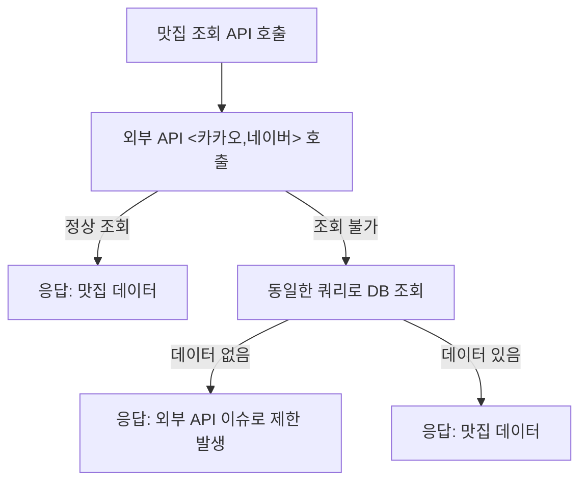
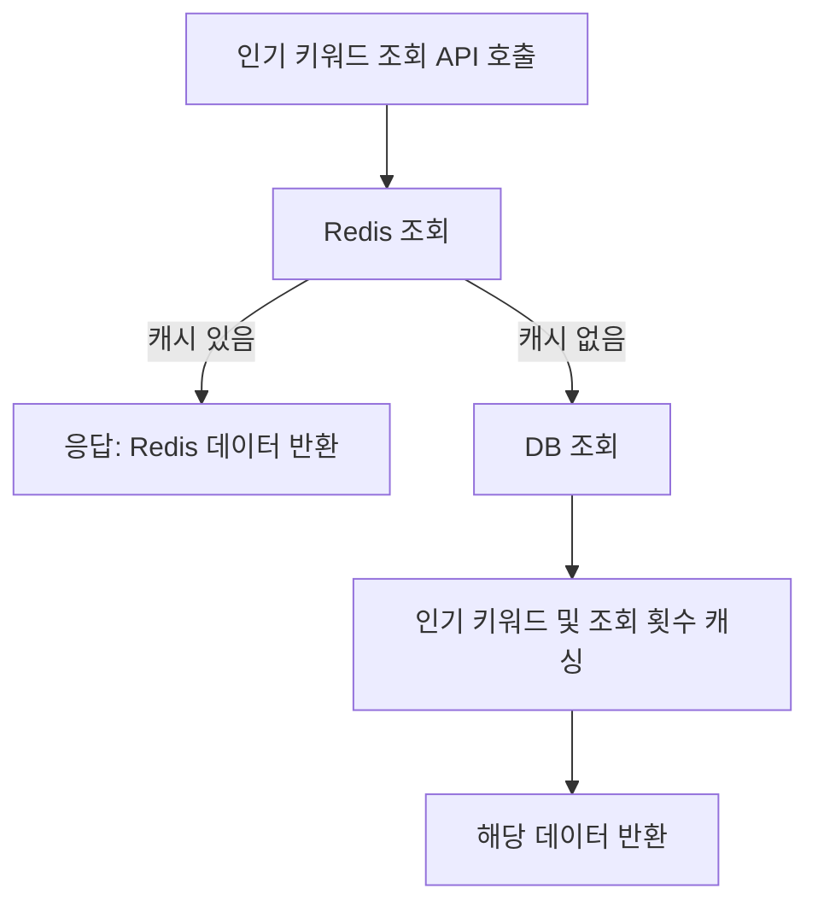

# 🔃 순서도 작성

  

## 1. 맛집 조회

```mermaid
flowchart TD
    A1[맛집 조회 API 호출] --> A2[외부 API <카카오,네이버> 호출]
    A2 --> |정상 조회| A3[응답: 맛집 데이터]
    A2 --> |조회 불가| A4[동일한 쿼리로 DB 조회]
    A4 --> |데이터 없음| A5[응답: 외부 API 이슈로 제한 발생]
    A4 --> |데이터 있음| A6[응답: 맛집 데이터]
```

 

## 2. 인기 키워드 조회

```mermaid
flowchart TD
    A1[인기 키워드 조회 API 호출] --> A2[Redis 조회]
    A2 --> |캐시 있음| A3[응답: Redis 데이터 반환]
    A2 --> |캐시 없음| A4[DB 조회]
    A4 --> A5[인기 키워드 및 조회 횟수 캐싱]
    A5 --> A6[해당 데이터 반환]

```

* 인기 키워드 조회 로직이 검색 성능에 영향을 최소화해야 함.