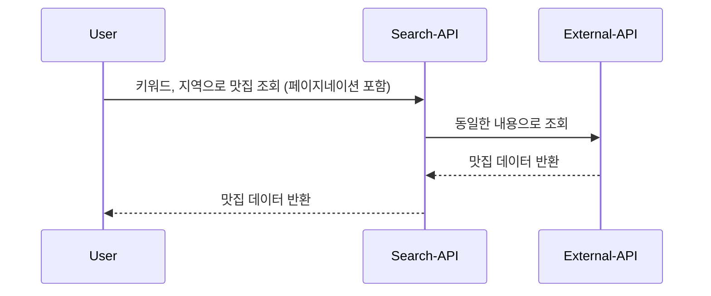
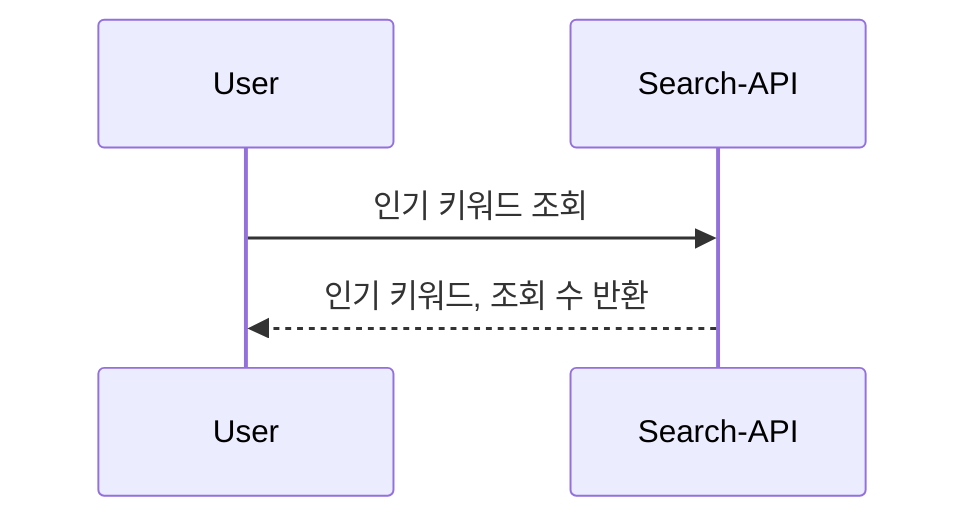

# 시퀀스 다이어그램

 

## 1. 맛집 조회

```mermaid
sequenceDiagram
    participant User
    participant Search-API
    participant External-API

    User ->> Search-API: 키워드, 지역으로 맛집 조회 (페이지네이션 포함)
    Search-API ->> External-API: 동일한 내용으로 조회
    External-API -->> Search-API: 맛집 데이터 반환
    Search-API -->> User: 맛집 데이터 반환
```
    
 

## 2. 인기 키워드 조회

```mermaid
sequenceDiagram
    participant User
    participant Search-API

    User ->> Search-API: 인기 키워드 조회
    Search-API -->> User: 인기 키워드, 조회 수 반환
```